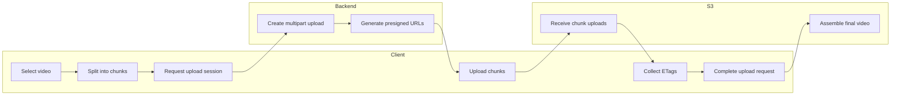
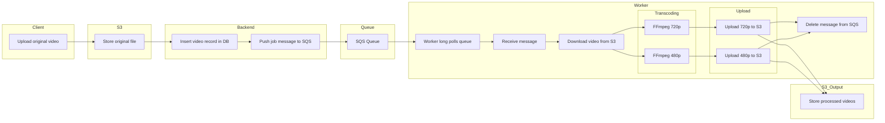

## Video Upload Pipeline

This diagram illustrates the video upload pipeline, showcasing the interaction between the client, backend, and S3 storage. The client selects a video, splits it into chunks, and requests an upload session from the backend. The backend creates a multipart upload and generates presigned URLs for each chunk. The client then uploads the chunks directly to S3 using the presigned URLs. Once all chunks are uploaded, the client collects the ETags and sends a complete upload request to the backend, which instructs S3 to assemble the final video.

## Transcoding pipeline

This diagram illustrates the video transcoding pipeline, showcasing the interaction between the client, S3 storage, backend, queue, worker, and output storage. The client uploads the original video to S3, which triggers the backend to insert a video record in the database and push a job message to an SQS queue. A worker long polls the queue, receives the message, and downloads the video from S3. The worker then transcodes the video into different resolutions (e.g., 720p and 480p) using FFmpeg. Finally, the transcoded videos are uploaded back to S3 for storage, and the corresponding messages are deleted from the SQS queue.