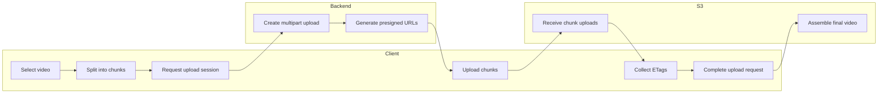

## Video Upload Pipeline

```mermaid
flowchart LR

subgraph Client
A[Select video]
B[Split into chunks]
C[Request upload session]
D[Upload chunks]
E[Collect ETags]
F[Complete upload request]
end

subgraph Backend
G[Create multipart upload]
H[Generate presigned URLs]
end

subgraph S3
I[Receive chunk uploads]
J[Assemble final video]
end

A --> B
B --> C
C --> G
G --> H
H --> D
D --> I
I --> E
E --> F
F --> J
```