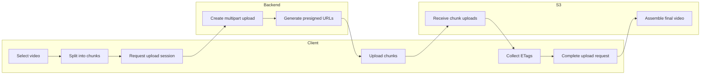
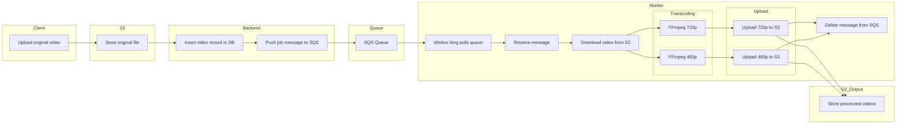
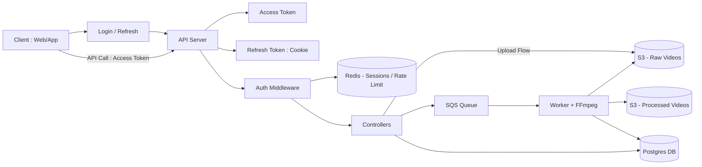

# Scalable Video Processing Platform

## Overview

This project is a backend system for secure video uploads and asynchronous processing. It is designed using production-style architecture with cloud storage, background workers, and message queues to handle large files efficiently.

---

## Authentication & Security

- Email/password-based authentication
- Short-lived **access tokens** for API requests  
- **Refresh tokens** stored in HTTP-only cookies  
- Refresh token tracking using **JTI in Redis** for session control  
- All API requests pass through an **auth middleware** that:
  - Verifies access tokens  
  - Validates session state via Redis  
  - Supports rate limiting  

---

## Video Upload

- Uses **multipart upload with pre-signed URLs**
- Files are uploaded directly from client to storage
- Backend manages upload sessions and completion

---

## Video Processing

- Upload completion triggers a job in a queue  
- Worker service processes videos asynchronously  
- Videos are transcoded into multiple resolutions  
- Processed files are stored back in cloud storage  

---

## System Design Highlights

- Scalable architecture using **message queues**
- **Direct-to-storage uploads** to reduce backend load  
- **Decoupled processing pipeline** using background workers  
- **Redis-based session management and rate limiting**  
- Clean separation between API, storage, and compute layers  

---

## Key Takeaways

This project demonstrates:

- Secure authentication and session handling  
- Efficient large file upload strategy  
- Asynchronous job processing  
- Production-style backend system design  

---

## Inspiration

Designed to reflect real-world architectures used in platforms like YouTube and Netflix.

# Video Upload Pipeline

```mermaid
flowchart LR

subgraph Client
A[Select video]
B[Split into chunks]
C[Request upload session]
D[Upload chunks]
E[Collect ETags]
F[Complete upload request]
end

subgraph Backend
G[Create multipart upload]
H[Generate presigned URLs]
end

subgraph S3
I[Receive chunk uploads]
J[Assemble final video]
end

A --> B
B --> C
C --> G
G --> H
H --> D
D --> I
I --> E
E --> F
F --> J
```

This diagram illustrates the video upload pipeline, showcasing the interaction between the client, backend, and S3 storage. The client selects a video, splits it into chunks, and requests an upload session from the backend. The backend creates a multipart upload and generates presigned URLs for each chunk. The client then uploads the chunks directly to S3 using the presigned URLs. Once all chunks are uploaded, the client collects the ETags and sends a complete upload request to the backend, which instructs S3 to assemble the final video.

## Transcoding pipeline

```mermaid
flowchart LR

subgraph Client
A[Upload original video]
end

subgraph S3
B[Store original file]
end

subgraph Backend
C[Insert video record in DB]
D[Push job message to SQS]
end

subgraph Queue
E[SQS Queue]
end

subgraph Worker
F[Worker long polls queue]
G[Receive message]
H[Download video from S3]

subgraph Transcoding
I1[FFmpeg 720p]
I2[FFmpeg 480p]
end

subgraph Upload
J1[Upload 720p to S3]
J2[Upload 480p to S3]
end

K[Delete message from SQS]
end

subgraph S3_Output
L[Store processed videos]
end

A --> B
B --> C
C --> D
D --> E

E --> F
F --> G
G --> H

H --> I1
H --> I2

I1 --> J1
I2 --> J2

J1 --> L
J2 --> L

J1 --> K
J2 --> K
```

This diagram illustrates the video transcoding pipeline, showcasing the interaction between the client, S3 storage, backend, queue, worker, and output storage. The client uploads the original video to S3, which triggers the backend to insert a video record in the database and push a job message to an SQS queue. A worker long polls the queue, receives the message, and downloads the video from S3. The worker then transcodes the video into different resolutions (e.g., 720p and 480p) using FFmpeg. Finally, the transcoded videos are uploaded back to S3 for storage, and the corresponding messages are deleted from the SQS queue.

## Overall Flow

```mermaid
flowchart LR

%% -------- CLIENT --------
A[Client : Web/App]

%% -------- AUTH --------
B[Login / Refresh]
C[Access Token]
D[Refresh Token : Cookie]

%% -------- BACKEND --------
E[API Server]
F[Auth Middleware]
G[Controllers]

%% -------- DATA --------
H[(Postgres DB)]
I[(Redis - Sessions / Rate Limit)]

%% -------- STORAGE --------
J[(S3 - Raw Videos)]
K[(S3 - Processed Videos)]

%% -------- ASYNC --------
L[SQS Queue]
M[Worker + FFmpeg]

%% -------- FLOWS --------

%% Auth
A --> B --> E
E --> C
E --> D

%% Every request
A -->|API Call : Access Token| E
E --> F
F --> I
F --> G

%% Upload (abstracted)
G -->|Upload Flow| J

%% Trigger processing
G --> L

%% Worker pipeline (abstracted)
L --> M
M --> J
M --> K

%% DB updates
G --> H
M --> H
```

# Docker Setup

This project uses Docker to run a multi-service architecture:

-   **Frontend** (React/Vite → Nginx)
-   **Backend** (FastAPI)
-   **Worker** (SQS consumer + ffmpeg)

------------------------------------------------------------------------

## Project Structure

    .
    ├── backend/
    ├── workers/
    ├── frontend/
    └── docker-compose.yml

------------------------------------------------------------------------

## Environment Variables

Create `.env` files for each service.

### Backend

    cp backend/.env.example backend/.env

Example:

    FRONTEND_URL=http://localhost:5173
    REDIS_URL=...
    AWS_REGION=...

------------------------------------------------------------------------

### Worker

    cp workers/.env.example workers/.env

Example:

    AWS_ACCESS_KEY_ID=...
    AWS_SECRET_ACCESS_KEY=...
    AWS_REGION=...
    SQS_QUEUE_URL=...

------------------------------------------------------------------------

### Frontend (for local development only)

    cp frontend/.env.example frontend/.env

Example:

    VITE_API_URL=http://localhost:8000

> Frontend `.env` is only for local dev. Docker uses build args.

------------------------------------------------------------------------

## unning the Application

    docker-compose up --build

------------------------------------------------------------------------

## Services

  Service    URL
  ---------- -----------------------
  Frontend   http://localhost:5173
  Backend    http://localhost:8000

------------------------------------------------------------------------

## How It Works

### Frontend → Backend

Browser loads frontend at:

    http://localhost:5173

API calls go to:

    http://localhost:8000

Docker forwards traffic to the backend container.

------------------------------------------------------------------------

### Container Networking

Inside Docker:

    http://backend:8000

Works only between containers, not in browser.

------------------------------------------------------------------------

## Key Concepts

### Port Mapping

    8000:8000 → backend
    5173:80   → frontend

Left = host, Right = container.

------------------------------------------------------------------------

### Frontend Env

-   Injected at build time
-   Not used at runtime

------------------------------------------------------------------------

### Backend CORS

    FRONTEND_URL=http://localhost:5173

------------------------------------------------------------------------

## Common Issues

### Backend not reachable

Ensure:

    8000:8000

------------------------------------------------------------------------

### CORS errors

Check frontend URL matches:

    http://localhost:5173

------------------------------------------------------------------------

### API errors

Do NOT use:

    http://backend:8000

Use:

    http://localhost:8000

------------------------------------------------------------------------

## Stop Containers

    docker-compose down

------------------------------------------------------------------------

## Rebuild

    docker-compose up --build

------------------------------------------------------------------------
